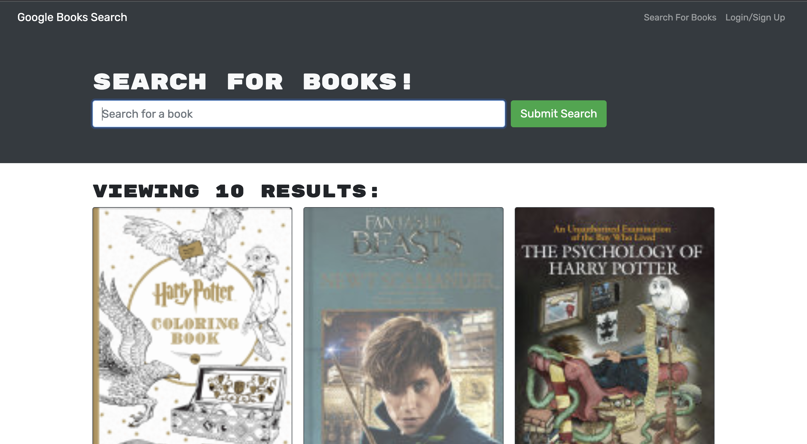

# MERN Book Search

## Description

MERN Book Search that allows user to login and create.edit books

## Table of Contents

- [Installation](#installation)
- [Usage](#usage)
- [Credits](#credits)
- [License](#license)
- [Features](#features)
- [Contributing](#contributing)
- [Tests](#tests)

## Installation

cd Develop && npm i

## Usage

Free to use!

## Credits

Ceri Trammell

## License

This project is licensed under the [MIT](https://opensource.org/licenses/MIT) license.

## Questions

If you have any questions, please reach out to me at: [cerihaf@gmail.com](mailto:cerihaf@gmail.com) OR [github.com/cerihaf](https://github.com/cerihaf)

## Features

## Contributing

## Tests
